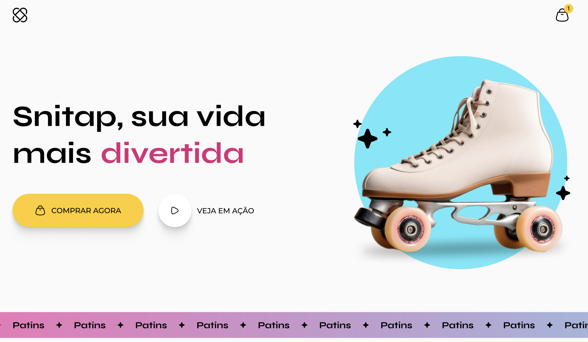

# Zingen
### Projeto de estudo de animações e transições com CSS puro

### 🚀 Tecnologias

Esse projeto foi desenvolvido com as seguintes tecnologias:

- HTML
- CSS

Bibliotecas
- [Google Fonts](https://fonts.google.com/)

### 💻 Projeto

Landing Page responsiva de uma pagina de patins com muitas animações e transições.
- aplicação de transform, transition, @keyframes, animation ... 

### 🔖 Layout

Você pode visualizar o layout do projeto através [desse link](https://www.figma.com/design/9YO2SSCOQFUKhCzCaBMjGs/LP-de-patins-animada--Community-?node-id=908-1045&t=KgHrp9vlZkEoY0Jc-0). 

###  ACESSE A PÁGINA [AQUI](https://amandasgm.github.io/lp-de-patins-animada/)

Ensinado com ♥ by Rocketseat 